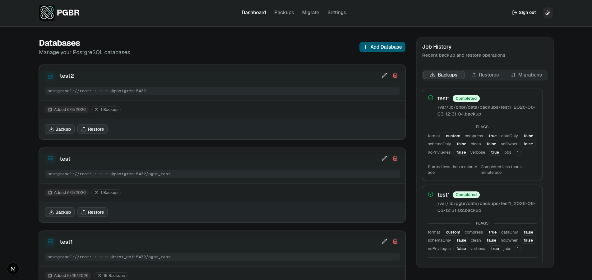
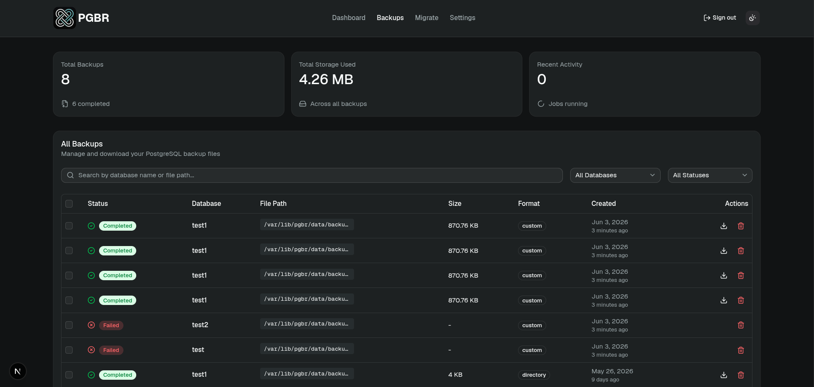
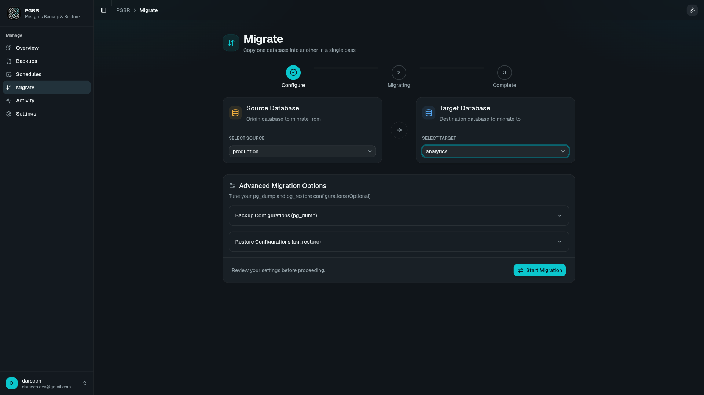

<div align="center">


<br/>

[](https://hub.docker.com/r/darseen/pgbr)

[](https://opensource.org/licenses/MIT)
<br/>
<br/>
[](https://railway.com/deploy/vaze?referralCode=InkF11&utm_medium=integration&utm_source=template&utm_campaign=generic)

# PGBR | PostgreSQL Backup & Restore

**pgbr** is a self-hosted tool built for developers who need reliable database backups. Manage your PostgreSQL backups with confidence by creating, restoring, migrating, and managing database backups using customizable flags and one-click operations directly from a clean web interface.

</div>

## Features

- **Secure Connection Storage**: Keep your database credentials safe with encrypted connection strings and masked UI displays.

- **Full `pg_dump`/`pg_restore` Support**: Gain complete control over your operations by configuring all native backup and restore flags directly through the interface.

- **Automated Backups**: Never miss a backup. Set up customizable cron jobs to automatically back up your databases on a schedule that works for you.

- **Seamless Migrations**: Easily migrate data from one PostgreSQL database to another with one-click data transfer tools.

## Getting Started

Getting your own pgbr instance running is simple. All you need is Docker installed on your system.

### 1\. Pull the Docker Image

Pull the latest image from Docker Hub.

Bash

```
docker pull darseen/pgbr:latest
```

### 2\. Run the Container

Run the Docker container, mapping your volume, port, and setting your required environment variables:

Bash

```
docker run -d\
  -p 3000:3000\
  -v /path/on/your/machine:/var/lib/pgbr\
  -e AUTH_SECRET="your-secret-key"\
  -e BASE_URL="http://<your-server-ip>:3000"\
  --name pgbr\
  darseen/pgbr:latest

```

### 3\. Initial Setup

Once the container is running, you need to create your admin user to start managing your databases.

1.  Navigate to your server's IP address on port 3000 in your web browser: `http://<your-server-ip>:3000`

2.  You will be prompted to register. The first user to register automatically becomes the admin.

3.  Log in, add your first PostgreSQL connection, and start managing your backups!

## Environment Variables

The following environment variables should be set for optimal security and configuration.

- `PGBR_DATA`: The path to your data directory.

- `AUTH_SECRET`: A secure, random string used to sign user sessions.

- `BASE_URL`: The base URL of your pgbr instance.

## Screenshots

Here is a look at the pgbr interface.

<div align="center">
  <h3> Dashboard View  </h3>
  
</div>

<div align="center">
  <h3> Backup Management Page </h3>
  
</div>

<div align="center">
  <h3> Migration Tool </h3>
  
</div>

## Contributing

Contributions are welcome! If you'd like to help improve pgbr by adding new flags, UI improvements, or features, please feel free to fork the repository, make changes, and submit a pull request.

## License

This project is licensed under the MIT License. See the LICENSE file for details.
