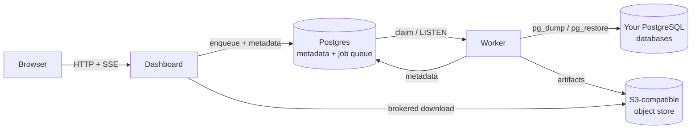

pgbr separates the thing that *decides* work happens (the dashboard) from the
thing that *does* it (the worker). Neither holds durable state, which is what
makes both safe to scale and restart.

## The services

### Dashboard

A Next.js app serving the UI and API. It never runs a dump or a restore; it
validates a request, writes metadata, and puts a job on a queue. The one place
it touches PostgreSQL directly is **Ping**, which shells out to `pg_isready`.

### Worker

A Node process polling three queues in Postgres. It spawns `pg_dump`,
`pg_restore`, and `psql` as child processes, streams the result to object
storage, and records the outcome in Postgres.

## Who owns what state

This is the design rule that explains most of pgbr's behaviour:

| State | Owner | Notes |
| --- | --- | --- |
| Users, connections, job history, schedules | **Postgres** | The source of truth. |
| Queued jobs, schedule timings | **Postgres** | Same database, same transactions. |
| Backup artifacts | **Object store** | The only irreplaceable data. |
| Scratch files during a job | Worker's `tmpdir` | Throwaway, deleted in a `finally`. |

Putting the queue in Postgres is what removes a whole class of failure. Enqueueing
happens in the same transaction as the write it belongs to, so a schedule can't
exist without its next run time, and a job can't be queued against a row that
was never committed. There is no second store to drift from, and nothing to
reconcile on boot.

<Callout type="info">
  Only the object store and Postgres need durable volumes. The dashboard and
  worker containers can be destroyed and recreated at will.
</Callout>

## How a backup flows

<Steps>

<Step>
### The dashboard validates and enqueues

The server action checks your session, confirms the database belongs to you, and
parses the flags against the shared Zod schema. It generates a job UUID, adds the
job to the `backup` queue, and returns immediately. Nothing has run yet.
</Step>

<Step>
### The worker claims the job

A worker picks it up and re-validates the flags — it does not trust the payload —
then re-checks that the database belongs to the requesting user.
</Step>

<Step>
### The row is written before the work starts

The worker upserts a `backup_jobs` row with status `running` **before** spawning
anything, then calls `updateProgress`. That ordering is what makes the UI live: by
the time the event reaches the browser, there is already a row to render.

The upsert is idempotent (`onConflictDoUpdate`) so a re-delivered job converges
onto the same row instead of duplicating it.
</Step>

<Step>
### `pg_dump` runs into scratch

The worker creates a temp directory, builds the argument list from your flags, and
spawns `pg_dump` — with the connection's password in `PGPASSWORD` rather than the
argument list, so it stays out of the container's process table. A non-zero exit
becomes the job's error message, taken from `pg_dump`'s own stderr.
</Step>

<Step>
### The artifact is uploaded

The dump is streamed to the object store under `backups/<job-id>.<ext>`, counting
bytes as they go, so the recorded size comes from the upload itself. Directory
dumps are collapsed into a tarball first — see [Storage](/docs/concepts/storage).
</Step>

<Step>
### The row is finalised, retention runs

Status becomes `completed`, size is recorded, and the database's lifetime backup
counter increments. If the job came from a schedule with a retention limit, old
backups are pruned. A retention failure is logged but never fails the backup.

Scratch is removed in a `finally`, so it goes away whether the job succeeded or
not.
</Step>

</Steps>

Restores follow the same shape in reverse: download to scratch, decompress or
expand if needed, spawn `pg_restore` (or `psql` for plain SQL), record the
outcome.

## Why the UI updates without reloading

The dashboard exposes a Server-Sent Events stream at `/api/events`. It listens to
all three queues and emits a lightweight signal whenever any job changes state.
The browser debounces those signals and calls `router.refresh()`, which re-renders
the server components with fresh data.

The payload is deliberately just `{ queue, event }` — a nudge, not the data.
Pages re-fetch through their normal server-side path, so there's only one place
where data is loaded and authorized.

This is also how **scheduled** backups appear live even though no browser
triggered them.

<Callout type="info">
  Migrations use a *separate* stream at `/api/migrate`, which holds the request
  open for one job and streams that job's progress. It's the one operation whose
  progress is tied to the request that started it.
</Callout>

## Failure behaviour

- **A worker dies mid-job** — its heartbeat goes stale and the reaper requeues the
  job within 90 seconds. Because processors upsert idempotently, the re-delivery
  converges rather than orphaning a `running` row. A job that stalls twice is
  failed for good and its history row closed out.
- **A dump fails** — the row is marked `failed` with `pg_dump`'s stderr, and the
  job throws so the queue records it.
- **Postgres restarts** — queued jobs are rows, so they are still there. Workers
  reconnect and resume claiming.
- **The object store is unreachable** — backups fail at upload and are recorded as
  failed. The dump itself is discarded with the scratch directory.

## Related

<Cards>
  <Card title="Jobs and queues" href="/docs/concepts/jobs-and-queues" />
  <Card title="Storage" href="/docs/concepts/storage" />
  <Card title="Security" href="/docs/concepts/security" />
</Cards>
