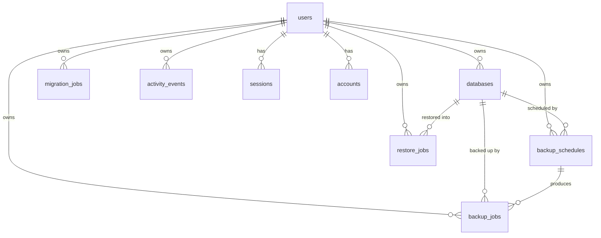

pgbr's own Postgres holds users, connections, job history, schedules, recorded
actions, and storage settings. Schema is defined with Drizzle in
`packages/db/src/schema/`; migrations
live in `packages/db/drizzle/` and are applied automatically by the dashboard's
entrypoint on boot.

<Callout type="info">
  This is pgbr's **metadata** database, not a database you back up. Losing it
  doesn't lose your artifacts — but it loses everything that tells you what those
  artifacts are.
</Callout>

## Relationships

## Auth tables

Managed by Better Auth.

### `users`

| Column | Type | Notes |
| --- | --- | --- |
| `id` | uuid | Primary key |
| `name` | text | |
| `email` | text | Unique |
| `email_verified` | boolean | Defaults false; pgbr doesn't verify |
| `username` | text | Unique |
| `display_username` | text | |
| `created_at` / `updated_at` | timestamp | |

There is **no role column**. "The first user is the admin" means they got in
first, not that they hold a privilege — every user is equivalent.

### `sessions`, `accounts`, `verifications`

Session tokens with expiry and IP/user-agent, credential records (hashed passwords
live in `accounts.password`), and verification tokens. All cascade on user
deletion, and each is indexed on the column it's looked up by.

## `databases`

A saved connection.

| Column | Type | Notes |
| --- | --- | --- |
| `id` | text | Primary key, UUID |
| `user_id` | uuid | → `users.id`, **set null** on delete |
| `name` | text | Unique **per user** (`databases_user_id_name_unique`) |
| `url` | text | Encrypted `iv:authTag:ciphertext` |
| `backup_count` | integer | Lifetime successful backups; only increments |
| `created_at` / `updated_at` | timestamp | |

`name` is unique per owner, matching what the create and update actions check, so
two users can each have a database named `production`. Reusing one of your own
names is rejected with "Database name already exists" rather than a constraint
violation surfaced as a generic error.

## `backup_jobs`

| Column | Type | Notes |
| --- | --- | --- |
| `id` | text | Primary key. A UUID, shared with the job's `job_queue` row |
| `database_id` | text | → `databases.id`, set null on delete |
| `user_id` | uuid | → `users.id`, set null on delete |
| `schedule_id` | text | → `backup_schedules.id`, set null on delete |
| `database_name` | text | **Denormalized** — survives the database being deleted |
| `status` | text | `pending` / `running` / `completed` / `failed` |
| `storage_key` | text | Logical object key, independent of any mount |
| `flags` | jsonb | The exact flags this dump ran with |
| `error` | text | The tool's stderr on failure |
| `size` | bigint | Bytes, counted during upload |
| `started_at` / `completed_at` | timestamp | |

The FKs all **set null** rather than cascade, which is what lets a backup outlive
its database and still be downloadable. `database_name` is denormalized for the
same reason — after the database is gone, it's the only record of what was dumped.

`flags` being stored per job is what makes an artifact self-describing: the
restore path reads the recorded format to decide whether the artifact needs
expanding.

`size` is a `bigint`. It was a 32-bit `integer` through 2.3.0, which capped at
2,147,483,647 bytes (~2 GB) and failed any larger backup at the very last step —
after the dump and upload had both succeeded. Migration `0004` widens the column
in place; existing rows are unaffected.

## `backup_schedules`

| Column | Type | Notes |
| --- | --- | --- |
| `id` | text | Primary key |
| `user_id` | uuid | → `users.id`, **cascade** on delete |
| `database_id` | text | → `databases.id`, **cascade**. Immutable after creation |
| `name` | text | |
| `cron_expression` | text | 5 fields |
| `timezone` | text | IANA. Defaults `UTC` |
| `enabled` | boolean | Defaults true |
| `flags` | jsonb | `pg_dump` flags for each run |
| `keep_last` | integer | Retention. Null = keep everything |
| `next_run_at` | timestamptz | When it fires next. Null = not scheduled yet |

Schedules **cascade** where jobs set null: a schedule with no database is
meaningless, but a backup without one is still an artifact you might need.

The row is the scheduler. `next_run_at` is the only thing that makes a schedule
fire, so there is no derived registration anywhere to reconcile. A null means
"not scheduled yet" — the worker computes the next occurrence without firing,
which is what stops a fresh upgrade from running every schedule at once.

## `job_queue`

| Column | Type | Notes |
| --- | --- | --- |
| `id` | text | Primary key. Shared with the job's history row |
| `queue` | text | `backup` / `restore` / `migrate` |
| `user_id` | uuid | → `users.id`, **cascade** on delete |
| `payload` | jsonb | The job's arguments |
| `status` | text | `pending` / `active` / `completed` / `failed` |
| `run_at` | timestamptz | Not claimable before this |
| `attempts` | integer | Incremented on claim |
| `max_attempts` | integer | Defaults 1 — nothing retries automatically |
| `stalls` | integer | Counted separately from attempts |
| `locked_by` | text | Which worker holds it |
| `locked_at` / `heartbeat_at` | timestamptz | Staleness is judged on the heartbeat |
| `last_error` | text | |
| `created_at` / `completed_at` | timestamptz | |

Sharing `id` with the history row is what makes a re-delivered job land on the
row it already created instead of orphaning it.

Two partial indexes back the hot paths — `(queue, run_at) WHERE status =
'pending'` for claiming and `(heartbeat_at) WHERE status = 'active'` for
reaping. Their predicates have to match the queries exactly or Postgres won't
use them.

Two triggers `pg_notify` the `pgbr_jobs` channel when a row becomes claimable,
on insert and on requeue. Emitting from a trigger rather than application code
covers rows the scheduler and reaper write, and can't be forgotten at a new call
site.

Rows are purged seven days after they finish. The history tables are the
permanent record; these are bookkeeping.

## `restore_jobs`

| Column | Type | Notes |
| --- | --- | --- |
| `id` | text | Primary key, UUID |
| `database_id` | text | The **target**. → `databases.id`, set null |
| `user_id` | uuid | → `users.id`, set null |
| `database_name` | text | Denormalized target name |
| `status` | text | Same four values |
| `storage_key` | text | The tracked backup's key, or a custom upload's |
| `flags` | jsonb | |
| `error` | text | |
| `started_at` / `completed_at` | timestamp | |

No `size` — a restore consumes an artifact, it doesn't produce one.

## `migration_jobs`

| Column | Type | Notes |
| --- | --- | --- |
| `id` | text | Primary key, UUID |
| `user_id` | uuid | → `users.id`, set null |
| `source_database_id` / `target_database_id` | text | Null for custom URLs |
| `source_database_url` / `target_database_url` | text | **Encrypted** |
| `source_database_name` / `target_database_name` | text | Null for custom URLs |
| `backup_flags` / `restore_flags` | jsonb | Both sides |
| `status` | text | |
| `error` | text | Filtered stderr, truncated at 3,000 chars |
| `size` | bigint | Bytes streamed from `pg_dump` into `pg_restore` |
| `started_at` / `completed_at` | timestamp | |

Both URLs are stored encrypted, including custom ones you never saved as
connections — a migration record shouldn't be a plaintext credential leak.

A migration streams straight from `pg_dump` into `pg_restore` and never lands an
artifact, so `size` is counted as the bytes cross the pipe rather than measured
from a file. It records the dump's size, not the space used in the target, and is
recorded even when the restore side fails.

## `activity_events`

What the [Activity](/docs/guides/activity) feed shows beyond the job tables: the
destructive changes that leave no row of their own behind.

| Column | Type | Notes |
| --- | --- | --- |
| `id` | uuid | Primary key |
| `user_id` | uuid | → `users.id`, **cascade** on delete |
| `action` | text | `database.deleted`, `schedule.deleted`, `backup.deleted`, `restore.deleted`, `migration.deleted`, `restores.cleared`, `migrations.cleared`, `storage.updated`, `data.nuked` |
| `summary` | text | The line rendered in the feed |
| `details` | jsonb | Per-action context: counts, names, the cron a deleted schedule ran on |
| `created_at` | timestamptz | |

Jobs are **not** copied in here. The feed reads `backup_jobs`, `restore_jobs`,
and `migration_jobs` directly and this table covers only what those don't record,
so there is no second copy of a job to fall out of step with the first.

`created_at` is `timestamptz` where the job tables' timestamps are naive. An
audit row is ordered against rows written by other processes, so the offset
belongs in the value rather than in a convention about what the value means.

This is the one table that **cascades** on user deletion rather than setting
null: a job row outlives its user because the artifact does, but a record of who
did what is worthless once the who is gone.

Writes are best-effort: a failed insert is logged and never fails the action it
describes. Deleting *from* the Activity page is deliberately not recorded.

## `storage_settings`

A **singleton** row with id `default`.

| Column | Type | Notes |
| --- | --- | --- |
| `id` | text | Primary key, always `default` |
| `endpoint` | text | |
| `region` | text | |
| `bucket` | text | |
| `access_key_id` | text | Plaintext — not a secret |
| `secret_access_key` | text | **Encrypted**. Never returned to the client |
| `force_path_style` | boolean | Defaults true |

Its presence is what makes the settings page report `source: "settings"` instead of
`"environment"`. Absent, everything falls back to `STORAGE_*` and then the built-in
defaults.

## Migration history

| Migration | Change |
| --- | --- |
| `0000_breezy_lady_bullseye` | Initial schema |
| `0001_late_blink` | |
| `0002_add_storage_key_and_settings` | Added `storage_key` and `storage_settings` — the move to object storage |
| `0003_drop_backup_path` | Dropped the old filesystem `backup_path` |
| `0004_fine_magneto` | Widened `size` to `bigint`; made database names unique per user |
| `0005_adorable_deadpool` | Added `job_queue` and `next_run_at`, the move off Redis |
| `0006_tidy_moonstone` | Added `activity_events` |

`0002`/`0003` are split deliberately: adding the new column and dropping the old
one in one step makes `drizzle-kit generate` ask whether it's a rename, which it
can't do in a non-TTY shell. Add first, drop second.

## Conventions

- **`snake_case`** column naming, configured on the Drizzle client
- **`timestamps`** — `created_at` / `updated_at`, with `updated_at` auto-touched
- **Encrypted columns** store `iv:authTag:ciphertext`, hex-encoded
- **Job IDs are `text`**, not `uuid` — they hold UUIDs today, but the column type
  predates that and widening is free
- **Denormalized names** on job rows, so history survives its subject

## Related

<Cards>
  <Card title="HTTP API" href="/docs/reference/api" />
  <Card title="Security" href="/docs/concepts/security" />
</Cards>
